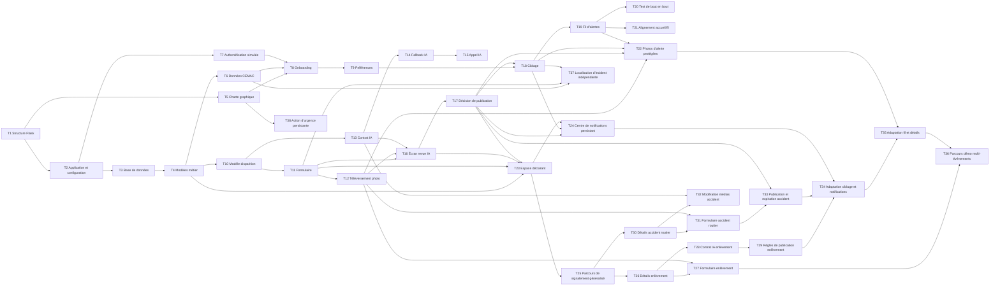

# SAVE-US — Roadmap Jour 1

Ce document découpe le plan d’exécution du Jour 1 du PRD en tâches unitaires, testables et ordonnables. L’objectif est de livrer le parcours de démonstration : inscription, déclaration de disparition, revue IA, publication et fil d’alertes géociblé.

## Maintenance documentaire

Lorsqu’une modification approuvée change l’intention du produit, la promesse utilisateur, le périmètre, une règle de sécurité ou un critère d’acceptation, le PRD et les deux fichiers de roadmap doivent être mis à jour. Les raffinements déjà couverts par le PRD sont consignés ci-dessous comme consolidation post-T20.

## Dépendances globales

## Tâches unitaires

| ID | Tâche | Livrable / définition de terminé | Dépendances |
|---|---|---|---|
| T1 | Initialiser le projet | Environnement Python, Flask, structure `app/`, `templates/`, `static/` et `.gitignore` prêts. | — |
| T2 | Configurer l’application | Factory Flask, configuration, route d’accueil, erreurs et lancement local fonctionnels. | T1 |
| T3 | Mettre en place la base de données | SQLite et SQLAlchemy configurés ; création des tables reproductible. | T2 |
| T4 | Créer les modèles métier de base | `User`, `AlertPreference`, `Alert` et statuts d’alerte définis. | T3 |
| T5 | Installer la charte graphique | Logo, palette SAVE-US, typographie, en-tête, pied de page et styles responsive appliqués. | T1 |
| T6 | Charger les données CEMAC | Pays, subdivisions, régions du Cameroun et utilisateurs de démonstration disponibles. | T3, T4 |
| T7 | Créer l’authentification simulée | Connexion téléphone/OTP simulée et session utilisateur fonctionnelles. | T2, T4 |
| T8 | Créer l’onboarding | Choix obligatoire du pays et de la région principale, sauvegardé sur le profil. | T5, T6, T7 |
| T9 | Créer les préférences | Catégories, régions suivies et préférence e-mail modifiables. | T4, T6, T8 |
| T10 | Définir le détail d’une disparition | Modèle `MissingPersonDetails` et règles des champs obligatoires disponibles. | T4 |
| T11 | Construire le formulaire de disparition | Formulaire anglais, validations serveur et création de brouillon fonctionnels. | T5, T7, T10 |
| T12 | Ajouter le téléversement de photo | Stockage local de démo, validation du fichier et aperçu sécurisé. | T11 |
| T13 | Définir le contrat IA | Schéma d’entrée/sortie structuré : résumé, données manquantes, doublons, scores et motifs. | T2, T10 |
| T14 | Créer le mode de secours IA | Réponses de démo déterministes disponibles si l’API IA est indisponible. | T13 |
| T15 | Intégrer l’analyse IA réelle | Appel côté serveur, validation de la réponse et repli automatique vers T14. | T13, T14 |
| T16 | Construire l’écran de revue IA | Résumé, données extraites, champs manquants, doublons, scores et décision affichés. | T5, T11, T12, T13 |
| T17 | Appliquer la règle de publication | Publication si confiance ≥ 80 et risque de fraude < 80 ; sinon blocage/modération. | T4, T16 |
| T18 | Implémenter le ciblage | Sélection par pays, région, catégories et préférences utilisateur. | T4, T9, T17 |
| T19 | Construire le fil d’alertes | Cartes d’alerte ciblées, filtrées et stylées selon la charte. | T5, T18 |
| T20 | Tester le parcours de démonstration | Le scénario Cameroun/Centre complet passe sans erreur. | T7, T11, T15, T17, T19 |

## Journal de consolidation post-T20

| ID | Tâche | Livrable / définition de terminé | Dépendances | Statut |
|---|---|---|---|---|
| T21 | Aligner l’accueil avec le fil d’alertes | Home devient un tableau de bord vivant affichant jusqu’à trois alertes récentes ciblées par préférences, un compteur d’alertes actives et la couverture ; Alerts conserve le fil complet, recherché et filtrable. | T18, T19 | Terminé |
| T22 | Diffuser les photos d’alerte de manière protégée | Les photos téléversées restent privées et ne sont visibles dans Home, Alerts et le détail que par le déclarant ou un destinataire éligible d’une alerte publiée. Les requêtes non autorisées renvoient `404` ; les réponses photo sont privées et non mises en cache. | T12, T17, T18, T19 | Terminé |
| T23 | Construire l’espace déclarant | My reports affiche uniquement les rapports du déclarant connecté, propose filtres statut/catégorie/recherche, reprise des brouillons, accès aux revues et alertes publiées, et consigne les actions motivées « personne retrouvée » ou « retrait » dans une piste d’audit non publique. | T4, T7, T11, T16, T17 | Terminé |
| T24 | Livrer le centre de notifications persistant | Les événements de publication, modération et clôture créent des notifications ciblées ; l’aperçu d’en-tête et la page de notifications affichent les états réels lu/non lu, les filtres, l’action explicite « tout marquer comme lu », des liens d’alerte protégés et l’état simulé de l’e-mail. | T17, T18, T23 | Terminé |
| T25 | Généraliser le parcours de signalement | Une entrée unique « Signaler un incident » permet à un utilisateur vérifié de choisir Missing person, Suspected abduction ou Road accident. Les brouillons, validations et accès déclarant restent isolés par type ; les catégories à venir utilisent des routes de transition séparées qui ne créent aucun brouillon avant leurs formulaires dédiés. | T4, T11, T23 | Terminé |
| T26 | Définir les détails d’un enlèvement présumé | Une migration et une entité dédiée prennent en charge photo facultative validée, date/heure, zone approximative, description, circonstances et contact privé, avec règles de champs côté serveur. La localisation reste sur l’alerte parente afin que le ciblage existant l’utilise. | T4, T25 | Terminé |
| T27 | Construire le formulaire d’enlèvement | Un formulaire anglais, mobile et en étapes permet photo facultative validée, brouillons, reprise, progression sûre, action explicite « Submit report » et confirmation privée, pendant que la revue spécifique est préparée par T28. | T5, T7, T12, T26 | Terminé |
| T28 | Définir le contrat IA d’enlèvement | Une entrée/sortie structurée et versionnée fournit résumé public sûr, données extraites, données manquantes, doublons possibles, confiance, risque de fraude et motifs. Le contact privé est exclu de l’entrée et les numéros sont refusés dans le résumé public. | T13, T26 | Terminé |
| T29 | Appliquer les règles de publication d’enlèvement | Le signalement est diffusé dans tout le pays si confiance ≥ 80 et risque de fraude < 80 ; sinon il entre en modération. Les enlèvements publiés restent visibles des modérateurs pour revue a posteriori. | T17, T28 | Terminé |
| T30 | Définir les détails d’un accident routier | Une entité dédiée stocke date/heure, localisation manuelle et coordonnées facultatives, région touchée, nombre de victimes, besoins immédiats, description et références média facultatives. | T4, T25 | Terminé |
| T31 | Construire le formulaire d’accident routier | Un formulaire mobile rapide offre géolocalisation facultative avec saisie manuelle de secours, validations serveur, brouillons et téléversement photo facultatif protégé. | T5, T7, T12, T30 | Terminé |
| T32 | Modérer les médias d’accident routier | Des contrôles serveur et IA identifient les médias d’accident invalides, sensibles ou graphiques, les bloquent ou envoient le signalement en modération avec explication claire. | T12, T13, T30 | Planifié |
| T33 | Appliquer publication et expiration d’accident | Les accidents publiés ciblent la région touchée ou un rayon défini, expirent automatiquement après 24 h et permettent une clôture manuelle motivée avec piste d’audit. | T17, T30, T31 | Planifié |
| T34 | Adapter le ciblage et les notifications | Les enlèvements atteignent tous les abonnés du pays ayant activé la catégorie ; les accidents atteignent les abonnés régionaux éligibles. Publication, modération, clôture et expiration utilisent ces règles. | T18, T24, T29, T33 | Planifié |
| T35 | Adapter le fil et les détails d’alerte | Home, Alerts, My reports et le détail affichent cartes, filtres, libellés de sûreté et médias protégés adaptés aux deux nouveaux types d’incident. | T19, T22, T29, T33, T34 | Planifié |
| T36 | Tester le parcours de démonstration multi-événements | Le test de bout en bout Cameroun/Centre couvre un enlèvement présumé national et un accident régional, y compris ciblage, notifications, expiration ou clôture et protection des médias non autorisés. | T27, T29, T31–T35 | Planifié |
| T37 | Séparer la localisation de l’incident de celle du déclarant | Les disparitions préremplissent mais ne verrouillent pas le pays et la région touchés. Le serveur valide le couple pays/région CEMAC choisi, le sauvegarde sur l’alerte et le ciblage existant utilise ce lieu d’événement. | T6, T11, T18 | Terminé |
| T38 | Garder l’action d’urgence persistante | La barre latérale desktop utilise une colonne compacte de hauteur fixe : seule la liste de navigation défile, tandis que le lien Settings et l’action Emergency report restent visibles en bas, avec des zones cliquables d’au moins 44 px. | T5 | Terminé |

## Chemin critique

`T1 → T2 → T3 → T4 → T10 → T11 → T16 → T17 → T18 → T19 → T20`

Consolidation post-T20 : `T19 → T21`, `T12 + T17 + T18 + T19 → T22`, `T4 + T7 + T11 + T16 + T17 → T23` et `T17 + T18 + T23 → T24`.

Chemin critique de l’extension multi-événements : `T25 → T26 → T27 → T28 → T29 → T34 → T35 → T36`. La branche accident routier `T25 → T30 → T31 → T33 → T34` doit également être terminée avant T36.

Correction de ciblage : `T6 + T11 + T18 → T37`.

Correction ergonomique de sûreté : `T5 → T38`.

## Travail parallélisable

- Dès que T1 est terminé : T5 peut avancer en parallèle de T2.
- Dès que T4 est terminé : T6 et T10 peuvent avancer en parallèle.
- Dès que T10 est terminé : T11 et T13 peuvent avancer en parallèle.
- T14/T15 peuvent être développées pendant la construction de T11/T12.
- Après T25, la branche enlèvement (T26–T29) et la branche accident routier (T30–T33) peuvent être réalisées en parallèle.
- T32 peut avancer en parallèle de T31 ; T34 débute une fois les règles de publication des deux nouvelles catégories prêtes.
