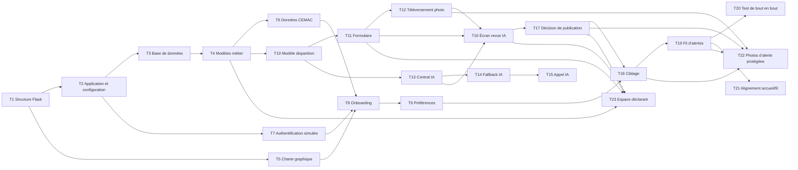

# SAVE-US — Roadmap Jour 1

Ce document découpe le plan d’exécution du Jour 1 du PRD en tâches unitaires, testables et ordonnables. L’objectif est de livrer le parcours de démonstration : inscription, déclaration de disparition, revue IA, publication et fil d’alertes géociblé.

## Maintenance documentaire

Lorsqu’une modification approuvée change l’intention du produit, la promesse utilisateur, le périmètre, une règle de sécurité ou un critère d’acceptation, le PRD et les deux fichiers de roadmap doivent être mis à jour. Les raffinements déjà couverts par le PRD sont consignés ci-dessous comme consolidation post-T20.

## Dépendances globales

## Tâches unitaires

| ID | Tâche | Livrable / définition de terminé | Dépendances |
|---|---|---|---|
| T1 | Initialiser le projet | Environnement Python, Flask, structure `app/`, `templates/`, `static/` et `.gitignore` prêts. | — |
| T2 | Configurer l’application | Factory Flask, configuration, route d’accueil, erreurs et lancement local fonctionnels. | T1 |
| T3 | Mettre en place la base de données | SQLite et SQLAlchemy configurés ; création des tables reproductible. | T2 |
| T4 | Créer les modèles métier de base | `User`, `AlertPreference`, `Alert` et statuts d’alerte définis. | T3 |
| T5 | Installer la charte graphique | Logo, palette SAVE-US, typographie, en-tête, pied de page et styles responsive appliqués. | T1 |
| T6 | Charger les données CEMAC | Pays, subdivisions, régions du Cameroun et utilisateurs de démonstration disponibles. | T3, T4 |
| T7 | Créer l’authentification simulée | Connexion téléphone/OTP simulée et session utilisateur fonctionnelles. | T2, T4 |
| T8 | Créer l’onboarding | Choix obligatoire du pays et de la région principale, sauvegardé sur le profil. | T5, T6, T7 |
| T9 | Créer les préférences | Catégories, régions suivies et préférence e-mail modifiables. | T4, T6, T8 |
| T10 | Définir le détail d’une disparition | Modèle `MissingPersonDetails` et règles des champs obligatoires disponibles. | T4 |
| T11 | Construire le formulaire de disparition | Formulaire anglais, validations serveur et création de brouillon fonctionnels. | T5, T7, T10 |
| T12 | Ajouter le téléversement de photo | Stockage local de démo, validation du fichier et aperçu sécurisé. | T11 |
| T13 | Définir le contrat IA | Schéma d’entrée/sortie structuré : résumé, données manquantes, doublons, scores et motifs. | T2, T10 |
| T14 | Créer le mode de secours IA | Réponses de démo déterministes disponibles si l’API IA est indisponible. | T13 |
| T15 | Intégrer l’analyse IA réelle | Appel côté serveur, validation de la réponse et repli automatique vers T14. | T13, T14 |
| T16 | Construire l’écran de revue IA | Résumé, données extraites, champs manquants, doublons, scores et décision affichés. | T5, T11, T12, T13 |
| T17 | Appliquer la règle de publication | Publication si confiance ≥ 80 et risque de fraude < 80 ; sinon blocage/modération. | T4, T16 |
| T18 | Implémenter le ciblage | Sélection par pays, région, catégories et préférences utilisateur. | T4, T9, T17 |
| T19 | Construire le fil d’alertes | Cartes d’alerte ciblées, filtrées et stylées selon la charte. | T5, T18 |
| T20 | Tester le parcours de démonstration | Le scénario Cameroun/Centre complet passe sans erreur. | T7, T11, T15, T17, T19 |

## Journal de consolidation post-T20

| ID | Tâche | Livrable / définition de terminé | Dépendances | Statut |
|---|---|---|---|---|
| T21 | Aligner l’accueil avec le fil d’alertes | Home devient un tableau de bord vivant affichant jusqu’à trois alertes récentes ciblées par préférences, un compteur d’alertes actives et la couverture ; Alerts conserve le fil complet, recherché et filtrable. | T18, T19 | Terminé |
| T22 | Diffuser les photos d’alerte de manière protégée | Les photos téléversées restent privées et ne sont visibles dans Home, Alerts et le détail que par le déclarant ou un destinataire éligible d’une alerte publiée. Les requêtes non autorisées renvoient `404` ; les réponses photo sont privées et non mises en cache. | T12, T17, T18, T19 | Terminé |
| T23 | Construire l’espace déclarant | My reports affiche uniquement les rapports du déclarant connecté, propose filtres statut/catégorie/recherche, reprise des brouillons, accès aux revues et alertes publiées, et consigne les actions motivées « personne retrouvée » ou « retrait » dans une piste d’audit non publique. | T4, T7, T11, T16, T17 | Terminé |

## Chemin critique

`T1 → T2 → T3 → T4 → T10 → T11 → T16 → T17 → T18 → T19 → T20`

Consolidation post-T20 : `T19 → T21`, `T12 + T17 + T18 + T19 → T22` et `T4 + T7 + T11 + T16 + T17 → T23`.

## Travail parallélisable

- Dès que T1 est terminé : T5 peut avancer en parallèle de T2.
- Dès que T4 est terminé : T6 et T10 peuvent avancer en parallèle.
- Dès que T10 est terminé : T11 et T13 peuvent avancer en parallèle.
- T14/T15 peuvent être développées pendant la construction de T11/T12.
