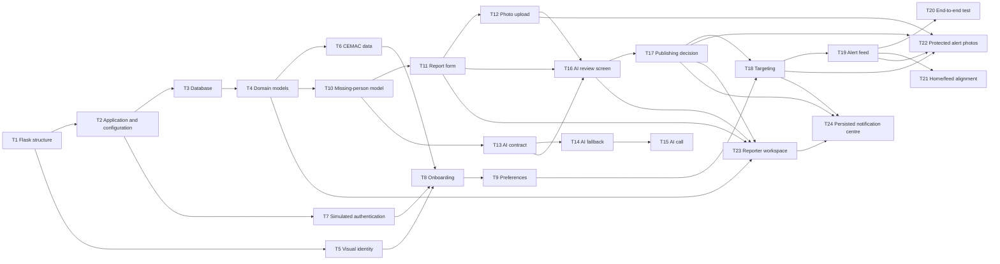

# SAVE-US — Day 1 Roadmap

This document breaks the PRD’s Day 1 execution plan into independent, testable, and ordered tasks. The goal is to deliver the demonstration journey: sign-up, missing-person reporting, AI review, publication, and a geo-targeted alert feed.

## Documentation maintenance

When an approved change alters the product intent, user promise, scope, safety rule, or acceptance criteria, update the PRD and both roadmap files. Refinements already covered by the PRD are logged below as post-T20 consolidation work.

## Overall dependencies

## Atomic tasks

| ID | Task | Deliverable / definition of done | Dependencies |
|---|---|---|---|
| T1 | Initialize the project | Python environment, Flask, `app/`, `templates/`, `static/` structure, and `.gitignore` are ready. | — |
| T2 | Configure the application | Flask factory, configuration, home route, error handling, and local startup work. | T1 |
| T3 | Set up the database | SQLite and SQLAlchemy are configured; table creation is repeatable. | T2 |
| T4 | Create base domain models | `User`, `AlertPreference`, `Alert`, and alert statuses are defined. | T3 |
| T5 | Apply visual identity | Logo, SAVE-US palette, typography, header, footer, and responsive styles are applied. | T1 |
| T6 | Seed CEMAC data | Countries, subdivisions, Cameroon regions, and demo users are available. | T3, T4 |
| T7 | Create simulated authentication | Simulated phone/OTP sign-in and user session work. | T2, T4 |
| T8 | Create onboarding | Required country and primary-region selection are saved to the profile. | T5, T6, T7 |
| T9 | Create preferences | Categories, followed regions, and email preference can be updated. | T4, T6, T8 |
| T10 | Define missing-person details | `MissingPersonDetails` model and required-field rules are available. | T4 |
| T11 | Build the missing-person form | English form, server validation, and draft creation work. | T5, T7, T10 |
| T12 | Add photo upload | Local demo storage, file validation, and safe preview work. | T11 |
| T13 | Define the AI contract | Structured input/output schema includes summary, missing data, duplicates, scores, and reasons. | T2, T10 |
| T14 | Create AI fallback mode | Deterministic demo responses are available if the AI API is unavailable. | T13 |
| T15 | Integrate live AI review | Server-side request, response validation, and automatic fallback to T14 work. | T13, T14 |
| T16 | Build the AI review screen | Summary, extracted data, missing fields, duplicates, scores, and decision are displayed. | T5, T11, T12, T13 |
| T17 | Apply the publishing rule | Publish when confidence ≥ 80 and fraud risk < 80; otherwise block/moderate. | T4, T16 |
| T18 | Implement targeting | Selection by country, region, category, and user preferences works. | T4, T9, T17 |
| T19 | Build the alert feed | Targeted, filtered, visually styled alert cards are displayed. | T5, T18 |
| T20 | Test the demo journey | The full Cameroon/Centre scenario completes without error. | T7, T11, T15, T17, T19 |

## Post-T20 consolidation log

| ID | Task | Deliverable / definition of done | Dependencies | Status |
|---|---|---|---|---|
| T21 | Align Home with the alert feed | Home is a compact live dashboard showing up to three recent preference-targeted alerts, an active-alert count, and coverage; Alerts remains the complete searchable and filterable feed. | T18, T19 | Completed |
| T22 | Deliver protected alert photos | Uploaded photos stay in private storage and appear on Home, Alerts, and alert detail only for the report owner or an eligible recipient of a published alert. Unauthorised requests return `404`; photo responses are private and non-cacheable. | T12, T17, T18, T19 | Completed |
| T23 | Build the reporter workspace | My reports lists only the signed-in reporter’s reports, supports status/category/search filters, resumes drafts, opens reviews and published alerts, and records reasoned “found” or “withdrawn” actions in a non-public audit trail. | T4, T7, T11, T16, T17 | Completed |
| T24 | Deliver the persistent notification centre | Publication, moderation, and closure events create targeted in-app notifications; the header preview and notification page show real unread/read state, filters, explicit “mark all as read”, safe alert links, and simulated e-mail delivery state. | T17, T18, T23 | Completed |

## Critical path

`T1 → T2 → T3 → T4 → T10 → T11 → T16 → T17 → T18 → T19 → T20`

Post-T20 consolidation: `T19 → T21`, `T12 + T17 + T18 + T19 → T22`, `T4 + T7 + T11 + T16 + T17 → T23`, and `T17 + T18 + T23 → T24`.

## Parallel work

- After T1: T5 can proceed in parallel with T2.
- After T4: T6 and T10 can proceed in parallel.
- After T10: T11 and T13 can proceed in parallel.
- T14/T15 can be developed while T11/T12 are being built.
