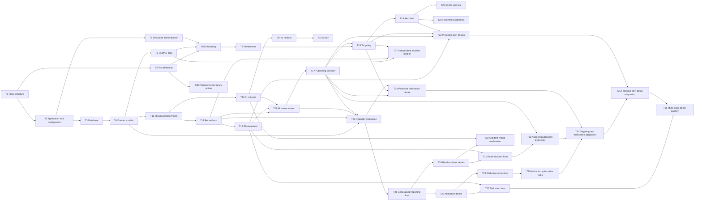

# SAVE-US — Day 1 Roadmap

This document breaks the PRD’s Day 1 execution plan into independent, testable, and ordered tasks. The goal is to deliver the demonstration journey: sign-up, missing-person reporting, AI review, publication, and a geo-targeted alert feed.

## Documentation maintenance

When an approved change alters the product intent, user promise, scope, safety rule, or acceptance criteria, update the PRD and both roadmap files. Refinements already covered by the PRD are logged below as post-T20 consolidation work.

## Overall dependencies

## Atomic tasks

| ID | Task | Deliverable / definition of done | Dependencies |
|---|---|---|---|
| T1 | Initialize the project | Python environment, Flask, `app/`, `templates/`, `static/` structure, and `.gitignore` are ready. | — |
| T2 | Configure the application | Flask factory, configuration, home route, error handling, and local startup work. | T1 |
| T3 | Set up the database | SQLite and SQLAlchemy are configured; table creation is repeatable. | T2 |
| T4 | Create base domain models | `User`, `AlertPreference`, `Alert`, and alert statuses are defined. | T3 |
| T5 | Apply visual identity | Logo, SAVE-US palette, typography, header, footer, and responsive styles are applied. | T1 |
| T6 | Seed CEMAC data | Countries, subdivisions, Cameroon regions, and demo users are available. | T3, T4 |
| T7 | Create simulated authentication | Simulated phone/OTP sign-in and user session work. | T2, T4 |
| T8 | Create onboarding | Required country and primary-region selection are saved to the profile. | T5, T6, T7 |
| T9 | Create preferences | Categories, followed regions, and email preference can be updated. | T4, T6, T8 |
| T10 | Define missing-person details | `MissingPersonDetails` model and required-field rules are available. | T4 |
| T11 | Build the missing-person form | English form, server validation, and draft creation work. | T5, T7, T10 |
| T12 | Add photo upload | Local demo storage, file validation, and safe preview work. | T11 |
| T13 | Define the AI contract | Structured input/output schema includes summary, missing data, duplicates, scores, and reasons. | T2, T10 |
| T14 | Create AI fallback mode | Deterministic demo responses are available if the AI API is unavailable. | T13 |
| T15 | Integrate live AI review | Server-side request, response validation, and automatic fallback to T14 work. | T13, T14 |
| T16 | Build the AI review screen | Summary, extracted data, missing fields, duplicates, scores, and decision are displayed. | T5, T11, T12, T13 |
| T17 | Apply the publishing rule | Publish when confidence ≥ 80 and fraud risk < 80; otherwise block/moderate. | T4, T16 |
| T18 | Implement targeting | Selection by country, region, category, and user preferences works. | T4, T9, T17 |
| T19 | Build the alert feed | Targeted, filtered, visually styled alert cards are displayed. | T5, T18 |
| T20 | Test the demo journey | The full Cameroon/Centre scenario completes without error. | T7, T11, T15, T17, T19 |

## Post-T20 consolidation log

| ID | Task | Deliverable / definition of done | Dependencies | Status |
|---|---|---|---|---|
| T21 | Align Home with the alert feed | Home is a compact live dashboard showing up to three recent preference-targeted alerts, an active-alert count, and coverage; Alerts remains the complete searchable and filterable feed. | T18, T19 | Completed |
| T22 | Deliver protected alert photos | Uploaded photos stay in private storage and appear on Home, Alerts, and alert detail only for the report owner or an eligible recipient of a published alert. Unauthorised requests return `404`; photo responses are private and non-cacheable. | T12, T17, T18, T19 | Completed |
| T23 | Build the reporter workspace | My reports lists only the signed-in reporter’s reports, supports status/category/search filters, resumes drafts, opens reviews and published alerts, and records reasoned “found” or “withdrawn” actions in a non-public audit trail. | T4, T7, T11, T16, T17 | Completed |
| T24 | Deliver the persistent notification centre | Publication, moderation, and closure events create targeted in-app notifications; the header preview and notification page show real unread/read state, filters, explicit “mark all as read”, safe alert links, and simulated e-mail delivery state. | T17, T18, T23 | Completed |
| T25 | Generalise the incident-reporting flow | A single “Report an incident” entry point lets a verified user select Missing person, Suspected abduction, or Road accident. Type-specific drafts, validation, and reporter access remain isolated; future categories use separate no-draft transition routes until their dedicated forms exist. | T4, T11, T23 | Completed |
| T26 | Define suspected-abduction details | A migration and dedicated details entity support an optional validated photo, date/time, approximate location, description, circumstances, and private contact with server-side field rules. The location remains on the parent alert so existing targeting can use it. | T4, T25 | Completed |
| T27 | Build the suspected-abduction form | A mobile-friendly English multi-step form supports validated optional photos, drafts, safe progress states, a plain “Submit report” action, and a private submission confirmation while the category-specific review is queued for T28. | T5, T7, T12, T26 | Completed |
| T28 | Define the abduction AI contract | Versioned structured input/output returns a safe public summary, extracted details, missing data, possible duplicates, confidence, fraud risk, and reasons. Private contact data is excluded from input and phone numbers are rejected from public summaries. | T13, T26 | Completed |
| T29 | Apply abduction publication rules | A report is distributed country-wide when confidence is at least 80 and fraud risk is below 80; otherwise it enters moderation. Published abduction reports remain visible to moderators for post-publication review. | T17, T28 | Completed |
| T30 | Define road-accident details | A dedicated entity stores date/time, manual location and optional coordinates, affected region, victim count, immediate needs, description, and optional media references. | T4, T25 | Completed |
| T31 | Build the road-accident form | A fast mobile reporting form offers optional device location with manual location fallback, server validation, drafts, and protected optional-photo upload. | T5, T7, T12, T30 | Planned |
| T32 | Moderate road-accident media | Server and AI checks identify unsafe, graphic, or invalid accident media and block it or route the report to moderation with a clear explanation. | T12, T13, T30 | Planned |
| T33 | Apply road-accident publication and expiry rules | Published accidents target the affected region or defined radius, expire automatically after 24 hours, and support reasoned manual closure with an audit trail. | T17, T30, T31 | Planned |
| T34 | Adapt targeting and notifications | Abductions reach all in-country subscribers who enabled the category; road accidents reach eligible regional followers. Publication, moderation, closure, and expiry notifications use the same rules. | T18, T24, T29, T33 | Planned |
| T35 | Adapt the alert feed and details | Home, Alerts, My reports, and alert details display category-appropriate cards, filters, safety labels, and protected media for the two new incident types. | T19, T22, T29, T33, T34 | Planned |
| T36 | Test the multi-event demonstration journey | The Cameroon/Centre end-to-end test covers one country-wide suspected abduction and one regional road accident, including targeting, notifications, expiry or closure, and unauthorised-media protection. | T27, T29, T31–T35 | Planned |
| T37 | Separate incident location from reporter location | Missing-person reports prefill but do not lock the affected country and region. The server validates the selected CEMAC country/region pair, persists it on the alert, and existing targeting uses that event location. | T6, T11, T18 | Completed |
| T38 | Keep the emergency action persistent | The desktop sidebar uses a compact, fixed-height column: only the navigation list may scroll, while the settings link and Emergency report action remain visible at the bottom with 44px minimum touch targets. | T5 | Completed |

## Critical path

`T1 → T2 → T3 → T4 → T10 → T11 → T16 → T17 → T18 → T19 → T20`

Post-T20 consolidation: `T19 → T21`, `T12 + T17 + T18 + T19 → T22`, `T4 + T7 + T11 + T16 + T17 → T23`, and `T17 + T18 + T23 → T24`.

Multi-event expansion critical path: `T25 → T26 → T27 → T28 → T29 → T34 → T35 → T36`. The road-accident branch `T25 → T30 → T31 → T33 → T34` must also complete before T36.

Targeting correction: `T6 + T11 + T18 → T37`.

Safety ergonomics correction: `T5 → T38`.

## Parallel work

- After T1: T5 can proceed in parallel with T2.
- After T4: T6 and T10 can proceed in parallel.
- After T10: T11 and T13 can proceed in parallel.
- T14/T15 can be developed while T11/T12 are being built.
- After T25, the abduction branch (T26–T29) and road-accident branch (T30–T33) can proceed in parallel.
- T32 can proceed in parallel with T31; T34 begins only once the publication rules for both new categories are ready.
